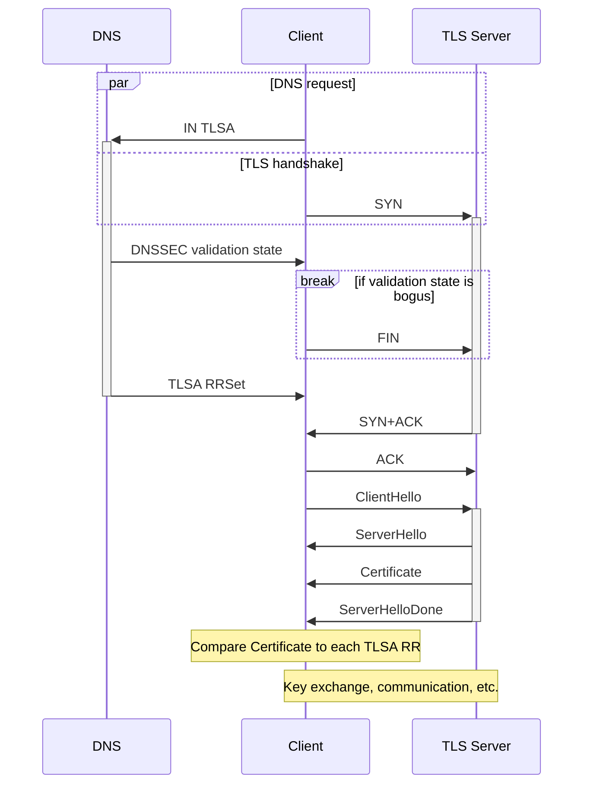

In the context of managing DANE, particularly using TLSA RRs, it is assumed, that DNSSEC is fully supported, and all relevant DNS zones are correctly signed and secure.

## [Overview of DNS zones and records](https://docs.microsoft.com/en-us/azure/dns/dns-zones-records)

* Hierarchy: `.`, `uk.`, `org.uk.`, etc.
* [DNS zones](https://en.wikipedia.org/wiki/DNS_zone) are specific portions of the DNS namespace, e.g. `*.example.com`.
* DNS records are specific parts of a zone. The record name is the relative record name and, together with the zone name, forms the fully qualified record name (e.g. `www` + `*.example.com` → `www.example.com`).
  * An apex record is a record for the root itself, usually denoted with an `@`, also called the “naked domain”.
  * [Record types](https://simpledns.plus/help/dns-record-types):
    * A (Host address)
    * AAAA (IPv6 host address)
    * ALIAS (Auto resolved alias)
    * CNAME (Canonical name for an alias)
    * MX (Mail eXchange)
    * NS (Name Server)
    * PTR (Pointer)
    * SOA (Start Of Authority)
    * SRV (location of service)
    * TXT (Descriptive text)
  * Records types used for DNSSEC:
    * DNSKEY (DNSSEC public key)
    * DS (Delegation Signer)
    * NSEC (Next Secure)
    * NSEC3 (Next Secure v. 3)
    * NSEC3PARAM (NSEC3 Parameters)
    * RRSIG (RRset Signature)
  * Less commonly used record types:
    * AFSDB (AFS Data Base location)
    * CAA (Certification Authority Authorization)
    * CERT (Certificate / CRL)
    * DHCID (DHCP Information)
    * DNAME (Non-Terminal DNS Name Redirection)
    * HINFO (Host information)
    * HTTPS (HTTPS Service binding and parameter specification)
    * LOC (Location information)
    * NAPTR (Naming Authority Pointer)
    * RP (Responsible person)
    * TLSA (Transport Layer Security Authentication)
* RRSets (resource record set) store multiple DNS records in a DNS zone that have the same name and are of the same type. A new set is required for a different name.

## [RFC 4034](https://datatracker.ietf.org/doc/html/rfc4034): Resource Records for the DNS Security Extensions

TODO …

## [RFC 4035](https://datatracker.ietf.org/doc/html/rfc4035): Protocol Modifications for the DNS Security Extensions

TODO …

## <https://datatracker.ietf.org/doc/html/rfc6698#section-4>

> An implementation of this protocol makes a DNS query for TLSA records, validates these records using DNSSEC, and uses the resulting TLSA records and validation status to modify its responses to the TLS server.

“This protocol” refers to necessary changes in client software.
From the abstract:

> This requires matching improvements in TLS client software, but no change in TLS server software.

An implementation needs to request TLSA RRs from the DNS, validate them, and use the results to communicate with a TLS server.

A TLS server is defined in <https://wiki.openssl.org/index.php/Simple_TLS_Server>.
Such a server performs the TLS handshake with a client, negotiates the SSL/TLS version to use, establishes a stateful connection (e.g. via sockets), reads and writes encrypted data.

Q: Is this essentially a dedicated component of a “website” that does nothing but encrypt and decrypt using some TLS/SSL API and maintains secure connections with clients?

A: …

> Determining whether a TLSA RRSet can be used MUST be based on the DNSSEC validation state (as defined in [RFC4033]).

A DNSSEC validation state exists for a TLSA RRSet.

Important quotes from the RFC with client requirements:

* secure → must use TLSA RRSet
* bogus → don’t start TLS handshake or abort it
* insecure | indeterminate → don’t use TLSA RRSet

> If an application receives zero usable certificate associations from a DNS request or from its cache, it processes TLS in the normal fashion without any input from the TLSA records.
> If an application receives one or more usable certificate associations, it attempts to match each certificate association with the TLS server's end entity certificate until a successful match is found.
> During the TLS handshake, if none of the certificate associations matches the certificate given by the TLS server, the TLS client MUST abort the handshake.

> An attacker who is able to divert a user to a server under his control is also likely to be able to block DNS requests from the user or DNS responses being sent to the user.

> Thus, in order to achieve any security benefit from certificate usage
> 0
> or 1,
> an application that sends a request for TLSA records needs to get
> either a valid signed response containing TLSA records
> or verification that the domain is insecure or indeterminate.

> If a request for a TLSA record does not meet one of those two criteria
> but the application continues with the TLS handshake anyway,
> the application has gotten no benefit from TLSA
> and SHOULD NOT make any internal or external indication that TLSA was applied.

> If an application has a configuration setting that has turned on TLSA use,
> or has any indication that TLSA is in use (regardless of whether or not this is configurable),
> that application
> either MUST NOT start a TLS connection
> or it MUST abort a TLS handshake
> if both of the two criteria above are not met.

> The application can perform the TLSA lookup before initiating the TLS handshake, or do it during the TLS handshake: the choice is up to the client.

Example lookups:

```sh
host -t TLSA _443._tcp.www.bortzmeyer.org.
host -t TLSA _443._tcp.www.huque.com.
nmap -vv -p 443 --script ssl-cert www.huque.com # [Displaying a remote SSL certificate details using CLI tools](https://serverfault.com/a/881415/1006139)
openssl x509 -in huque.pem -pubkey # For selector 1.
```

An example communication model of a TLSA-validating client looks like this:



Q: What exactly does the client need to do if no TLSA RR matches the cert from the TLS Server? Same thing like the “HTTPS-only mode”?

A: RFC 7671 specifies different options, e.g. in section 4.
See `Overview of DANE.md`, etc.

---

Q: What is the usual mechanism (e.g. protocol stack) by which authority over a DNS zone is granted?
In other words, how does a server admin — and no one else — manage DNS records for their own DNS zone — and none other?

A: …
