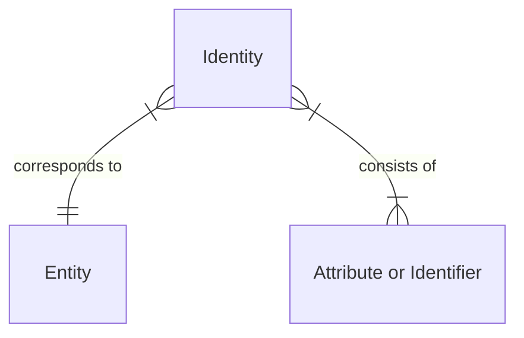
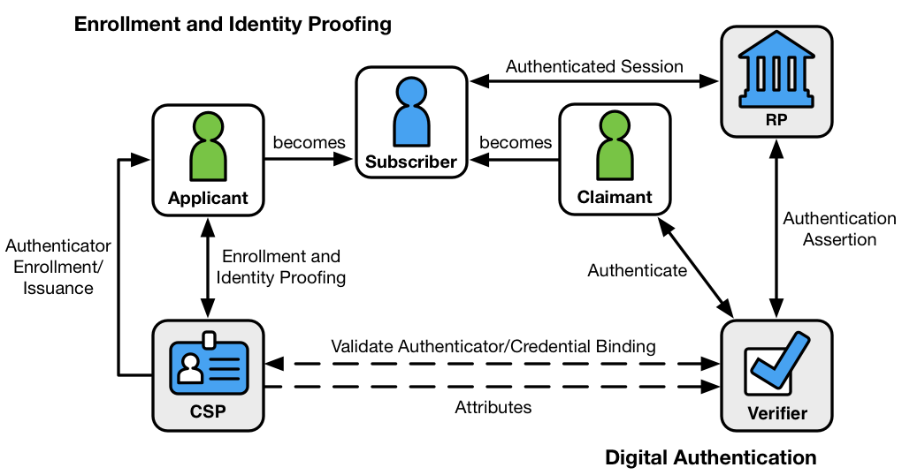
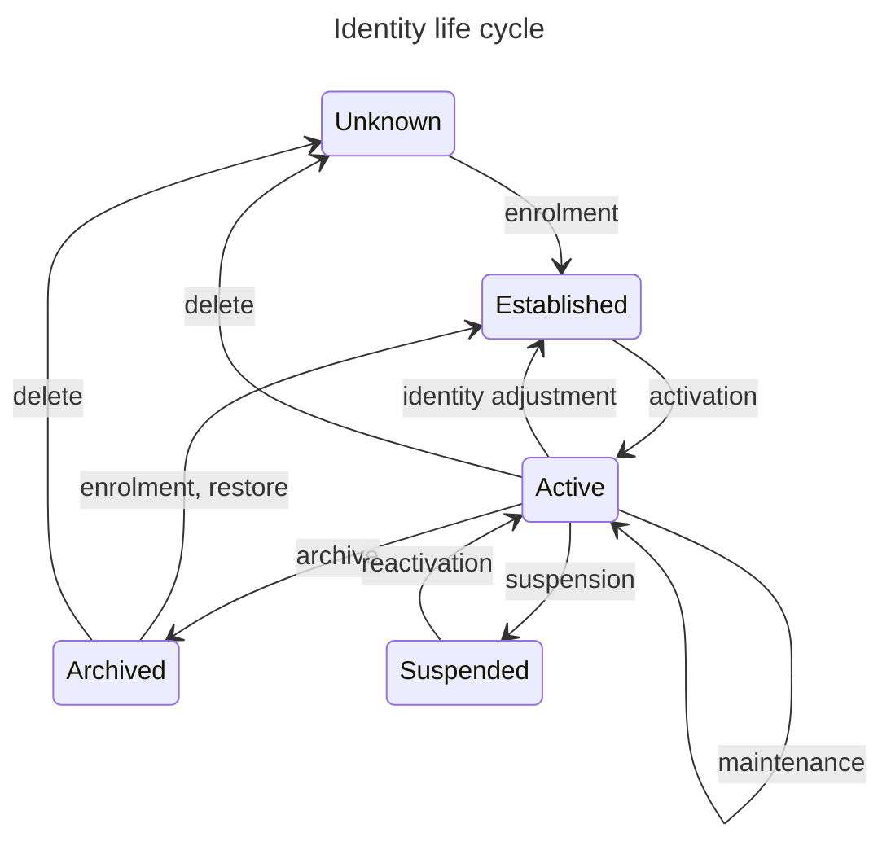

More general definition:

## [Life-cycle assessment](https://en.wikipedia.org/wiki/Life-cycle_assessment)

From ISO 14040:

> LCA studies the environmental aspects and potential impacts throughout a product’s life cycle (i.e. cradle-to-grave) from raw materials acquisition through production, use and disposal. The general categories of environmental impacts needing consideration include resource use, human health, and ecological consequences.

[Main ISO phases of LCA](https://en.wikipedia.org/wiki/Life-cycle_assessment#Main_ISO_phases_of_LCA).

### [RFC 1034](https://datatracker.ietf.org/doc/html/rfc1034): Domain Names – Concepts and Facilities and [RFC 1035](https://datatracker.ietf.org/doc/html/rfc1035): Domain Names – Implementation and Specification

The TTL field is used for a resolver’s caching. It appears to be unrelated to life cycles.

[DNS caching, section 8.2](https://datatracker.ietf.org/doc/html/rfc6698#section-8-2) might be relevant.

---

More specifically about identity life cycles:

Since various DNS entries are part of the identity of a server, their changes must also be considered: domain name changes, new CNAME entries, etc.
<!-- Another consideration is the importing and exporting of DNS entries from or to a different service. -->

## Identity management, identity life cycle

<https://en.wikipedia.org/wiki/Identity_management>

This article appears to be more about access management.
The thing being authenticated in the thesis is a TLS server; it is the identity in question.
I don’t think access control applies here directly.

> In addition to users, managed entities typically include hardware and network resources and even applications.

The point of the proposed application is to automatically synchronize TLSA RRs with TLS certs.
This isn’t “identity management” per se (or maybe only very broadly), unless the integration of this synchronization into both a DNS management software and a TLS certificate management software involves management of several resources specific to the target DNS zone and the target server, including serving TLS certificates, web hosting, database management, and hardware maintenance.

According to <https://en.wikipedia.org/wiki/File:Fig-IAM-phases.png>, identity management involves a configuration phase (which involves the registration of a user identity and the provisioning of credentials) and an operation phase (which involves presenting the user identity and authentication by credentials).
What follows is the access management, which involves access authorization in the configuration phase and access control in the operation phase.

However, the identity this software is trying to authenticate (or facilitate the authentication of) is a _server_ identity, not a _user_ identity.

> In the real-world context of engineering online systems, identity management can involve five basic functions:
> 
> * The **pure identity** function: Creation, management and deletion of identities without regard to access or entitlements;
> * […]

Axiomatic model:

* All identities in a given namespace are unique

Wikipedia offers neither a thorough explanation nor any references to what an “axiomatic model” of identities might be.

> Identity management can thus be defined as a set of operations on a given identity model, or more generally, as a set of capabilities with reference to it.
> 
> In practice, identity management often expands to express how model content is to be provisioned and reconciled among multiple identity models. 

> When organizations deploy an identity management process or system, their motivation is normally not primarily to manage a set of identities, but rather to grant appropriate access rights to those entities via their identities.
> In other words, access management is normally the motivation for identity management and the two sets of processes are consequently closely related.

> In addition to **creation, deletion, modification** of user identity data either assisted or self-service, identity management controls ancillary entity data for use by applications, such as contact information or location.
> 
> * Authentication: Verification that an entity is who/what it claims to be using a password, biometrics such as a fingerprint, or distinctive behavior such as a gesture pattern on a touchscreen.
> * […]

ISO

> * [ISO/IEC 24760-1 A framework for identity management – Part 1: Terminology and concepts](https://standards.iso.org/ittf/PubliclyAvailableStandards/c077582_ISO_IEC_24760-1_2019%28E%29.zip)
> * ISO/IEC 24760-2 A Framework for Identity Management – Part 2: Reference architecture and requirements
> * ISO/IEC DIS 24760-3 A Framework for Identity Management – Part 3: Practice
> * ISO/IEC 29115 Entity Authentication Assurance
> * ISO/IEC 29146 A framework for access management
> * ISO/IEC CD 29003 Identity Proofing and Verification
> * […]

> Identity management systems are concerned with the **creation, the administration and the deployment** of:
> 
> * Identifiers: Data used to identify a subject.
> * Credentials: Data providing evidence for claims about identities or parts thereof.
> * Attributes: Data describing characteristics of a subject.
> 
> The purposes of identity management systems are:
> 
> * Identification: Who is the user – used on logon or database lookup
> * Authentication: Is this the real user? Systems needs to provide evidence!
> * Authorization and non-repudiation: Authorization of documents or transaction with e-ID and most often with digital signature based on e-ID. Generates non-repudiation and receipts.

The [Solutions](https://en.wikipedia.org/wiki/Identity_management#Solutions) section mentions four subcategories, the first one of which is “Management of identities”.
This one contains processes such as “Provisioning and deprovisioning of accounts” and “Workflow automation”.
These are relevant.
The subcategory “Access control” seems to be entirely irrelevant.
Not sure about “Directory services” and “Other categories” (Federation, Directory-enabled networking).

<https://en.wikipedia.org/wiki/Identity_provider>

> An identity provider (abbreviated IdP or IDP) is a system entity that **creates, maintains, and manages** identity information for [principals](https://en.wikipedia.org/wiki/Principal_%28computer_security%29) and also provides **authentication services** to relying applications within a federation or distributed network.

<https://www.techtarget.com/searchsecurity/definition/identity-management-ID-management>

> Identity management (ID management) is the organizational process for ensuring individuals have the appropriate access to technology resources.

If this is the definition, then I’m _not_ building an identity manager, unless the definition needs to be rewritten to focus on servers instead.

> Managed identities can also refer to software processes that need access to organizational systems.

As far as I know, DANE authentication is not a means for access control.

> Identity management is focused on authentication, while access management is aimed at authorization.

This paragraph partially conflicts with the first one.

The rest of this article focuses on user identities.

Identity governance is very likely out of scope for the thesis.

> Attackers can take advantage of compromised user credentials to gain access to organizations’ network and data.

The only “right” that an authenticated server has is to continue establishing a TLS connection in order to serve encrypted data to a client.
Both together ensure authenticity and confidentiality.
However, clients can use opportunistic security and ignore a failed authentication, which would miss the point of authentication if access control was a concern, but in this case, this is the _current default_: servers are not DANE-authenticated nowadays because barely any client supports DANE.

Possible security vulnerabilities need to be evaluated specifically for servers as there are significant differences between machines and people.

<https://en.wikipedia.org/wiki/Information_lifecycle_management>

> Information lifecycle management (ILM) refers to strategies for administering storage systems on computing devices.

> ILM includes every phase of a "record" from its beginning to its end.
> And while it is generally applied to information that rises to the classic definition of a record (and thus related to records management), it applies to all informational assets.
> During its existence, information can become a record by being identified as documenting a business transaction or as satisfying a business need.
> In this sense ILM has been part of the overall approach of enterprise content management.

> Operational aspects of ILM include backup and data protection; disaster recovery, restore, and restart; archiving and long-term retention; data replication; and day-to-day processes and procedures necessary to manage a storage architecture.

The **Wikipedia life cycle**:

> * Creation and Receipt
> * Distribution (managing the information once it has been created or received)
> * Use
> * Maintenance (filing, retrieval and transfers)
> * Disposition

This has little to do with server identities; it is more about information management.
The “Disposition” stage is more about the decay of value of a piece of information; this is irrelevant when it comes to managing subdomains, TLS certificates, and TLSA records.

<https://pages.nist.gov/800-63-3/sp800-63-3.html>

* CSP: Credential Service Provider
* RA: Registration Authority
* IdM (IM): Identity Manager
* RP: Relying Party

> Identity proofing establishes that a subject is who they claim to be.
> Digital authentication establishes that a subject attempting to access a digital service is in control of one or more valid authenticators associated with that subject’s digital identity.

> Agencies use these guidelines as part of the risk assessment and implementation of their digital service(s).
> These guidelines provide mitigations of an authentication error’s negative impacts by separating the individual elements of identity assurance into discrete, component parts.

This might be more relevant for the section about security evaluation.

4.
Digital Identity Model

4.1
Overview

> Digital identity is the unique representation of a subject engaged in an online transaction.
> The process used to verify a subject’s association with their real world identity is called identity proofing.

Identity proofing is distinct from authentication.
In the context of DANE, we’re looking for _authentication_, because we confirm the identity of a server using a secondary source: the DNS.
We’re not concerned with the identity of the _physical_ server.

See this model:

Applicant becomes Subscriber through Identity Proofing.
Claimant is verified to be valid Subscriber through Authentication.

> The left side of the diagram shows the enrollment, credential issuance, lifecycle management activities, and various states of an identity proofing and authentication process.
> The usual sequence of interactions is as follows:
> 
> * An applicant applies to a CSP through an enrollment process.
> * The CSP identity proofs that applicant. Upon successful proofing, the applicant becomes a subscriber.
> * Authenticator(s) and a corresponding credential are established between the CSP and the subscriber.
> * The CSP maintains the credential, its status, and the enrollment data collected for the lifetime of the credential (at a minimum). The subscriber maintains his or her authenticator(s).
> 
> Other sequences are less common, but could also achieve the same functional requirements.

Authentication, last step:

> An authenticated session is established between the subscriber and the RP.

4.3.
Authentication and Lifecycle Management

This section links to the other NIST document and doesn’t actually contain anything about life cycle management itself.

> […], a credential binds an authenticator to the subscriber, via an identifier, as part of the issuance process.
> A credential is stored and maintained by the CSP, though the claimant may possess it.
> The claimant possesses an authenticator, but is not necessarily in possession of the credential.
> X.509 public key certificates are a classic example of credentials the claimant can, and often does, possess.

> The authentication process begins with the claimant demonstrating to the verifier possession and control of an authenticator that is bound to the asserted identity through an authentication protocol.
> Once possession and control have been demonstrated, the verifier verifies that the credential remains valid, usually by interacting with the CSP.

Q: Is this where DNSSEC comes into play — to demonstrate control over the DNS zone?

A: …

5.1
Overview

> This volume details requirements to assist agencies in avoiding:
> 
> 1. Identity proofing errors (i.e., a false applicant claiming an identity that is not rightfully theirs);
> 2. Authentication errors (i.e., a false claimant using a credential that is not rightfully theirs); and
> 3. Federation errors (i.e., an identity assertion is compromised).
> 
> From the perspective of an identity proofing failure, there are two dimensions of potential failure:
> 
> 1. The impact of providing a service to the wrong subject (e.g., an attacker successfully proofs as someone else).
> 2. The impact of excessive identity proofing (i.e., collecting and securely storing more information about a person than is required to successfully provide the digital service).

<!-- Although unlikely, the rest of section 5 is only going to be relevant when implementing the app.

Check against section 6 as well. -->

→ [SP 800-63B Authentication and Lifecycle Management](https://pages.nist.gov/800-63-3/sp800-63b.html)

<!-- … Continue with section 5: relevant subsection for DANE validation. -->

Most subsections of 5.1 are not relevant because DANE authentication does not involve secrets.

NIST 800-63-3 does not seem to be relevant.

6.
Authenticator Lifecycle Management

> These events include binding, loss, theft, unauthorized duplication, expiration, and revocation.

6.1.
Authenticator Binding

> Authenticator binding refers to the establishment of an association between a specific authenticator and a subscriber’s account, enabling the authenticator to be used — possibly in conjunction with other authenticators — to authenticate for that account.

> Throughout the digital identity lifecycle, CSPs SHALL maintain a record of all authenticators that are or have been associated with each identity.
> The CSP or verifier SHALL maintain the information required for throttling authentication attempts when required, as described in Section 5.2.2.

Throttling authentication attempts doesn’t seem relevant.

> The record created by the CSP SHALL contain the **date and time** the authenticator was bound to the account.
> The record SHOULD include information about the **source** of the binding (e.g., IP address, device identifier) of any device associated with the enrollment.

Date and time will probably be provided via RRSIG records; the TLS certificates themselves also contain the date they were issued.
“Source of the binding” doesn’t appear to be relevant for TLSA records.

6.1.1.
Binding at Enrollment

> The CSP SHALL bind at least one, and SHOULD bind at least two, physical (something you have) authenticators to the subscriber’s online identity, in addition to a memorized secret or one or more biometrics.
> Binding of multiple authenticators is preferred in order to recover from the loss or theft of the subscriber’s primary authenticator.

Not relevant; this is about user data.
However, I do see some relevance concerning information associated with servers: when a TLS certificate is associated with a server, a TLSA record shall be associated with it as well.
This association should not only be a link by reference, but the data associated with this transaction should be immutably stored in a log file.

> […] preservation of online material or an online reputation makes it undesirable to lose control of an account due to the loss of an authenticator.
> The second authenticator makes it possible to securely recover from an authenticator loss.
> For this reason, a CSP SHOULD bind at least two physical authenticators to the subscriber’s credential […] as well.

A TLSA record is not a credential that can easily be “lost”.
TLSA records can always be recreated; they are not secrets.
The existence of all relevant records, be it TLSA, TLS certificates, server identities, etc., can always be asserted — either periodically or immediately before critical operations.

The closest relevant concern here is if TLS certificates are compromised.

Guidelines about PII seem irrelevant.
The hostname of a server is known.

6.1.2.
Post-Enrollment Binding

6.1.2.1.
Binding of an Additional Authenticator at Existing AAL

The five DANE-related records each have independent use cases.
Creating and maintaining these record sets are not expected to be codependent.

6.1.4.
Renewal

> The CSP SHOULD bind an updated authenticator an appropriate amount of time before an existing authenticator’s expiration.

This is also the recommendation for TLS certificates.

6.2
Loss, Theft, Damage, and Unauthorized Duplication

Q: How can a DNS zone be compromised? How can a TLS server be compromised? Probably need a bit more research here.

A: …

> Generally, one must assume that a lost authenticator has been stolen or compromised by someone that is not the legitimate subscriber of the authenticator.

> Suspension, revocation, or destruction of compromised authenticators SHOULD occur as promptly as practical following detection.
> Agencies SHOULD establish time limits for this process.

Key compromise (relating to the TLS certificate) is relevant here.
User authentication for the purpose of reporting loss and issuing a revocation of the certificate is achieved by entirely separate means; this authentication has nothing to do with the keys involved in the TLS certification itself.

> The suspension SHALL be reversible if the subscriber successfully authenticates to the CSP using a valid (i.e., not suspended) authenticator and requests reactivation of an authenticator suspended in this manner.

TLS certificates are only revoked once and can trivially be replaced.
Being able to re-establish a TLS certificate for authentication is not likely to be sensible, but information from the certificates might be reused for future certificates.

6.3.
Expiration

> If and when an authenticator expires, it SHALL NOT be usable for authentication.

This is in conflict with RFC 7671, unless the TLS certificate itself is not the authenticator.
If we focus on TLSA entries, then their validity period is tied to the DNSSEC signature process<!-- (this is still an open question) -->.
Maintaining the DNSSEC signatures is indeed a vital requirement in order for DANE to work, but DANE itself doesn’t necessarily have anything that needs to be re-signed periodically.

If DANE validation fails, a client may refuse the TLS connection.
If a DNS zone is secure, but no DANE-related records are present, it means there is no DANE-related protocol to validate with.
A DNS zone might also _not_ be secure.
Opportunistic clients will still attempt to establish a TLS connection, but other types of clients will have different policies.

> When an authentication is attempted using an expired authenticator, the CSP SHOULD give an indication to the subscriber that the authentication failure is due to expiration rather than some other cause.

A client is not likely to initiate TLSA authentication if DNSSEC validation fails in the first place.

> The CSP SHALL require subscribers to surrender or prove destruction of any physical authenticator containing attribute certificates signed by the CSP as soon as practical after expiration or receipt of a renewed authenticator.

This is in line with the guidelines from RFC 7671 and others: obsolete TLSA records should be removed.

6.4.
Revocation and Termination

> Revocation of an authenticator — sometimes referred to as termination, especially in the context of PIV authenticators — refers to removal of the binding between an authenticator and a credential the CSP maintains.
> 
> CSPs SHALL revoke the binding of authenticators promptly when an online identity ceases to exist […], when requested by the subscriber, or when the CSP determines that the subscriber no longer meets its eligibility requirements.

Effectively, the TLS certificate must be rendered unusable.
TLS certificates do have a specified revocation procedure.
The TLSA records are simply deleted from the zone.
A log file will probably still maintain archival data where the existence of a previous binding between a server and a TLSA record could be found.

### `2019-05 ISO-IEC 24760-1 IT Security and Privacy – A framework for identity management – Part 1: Terminology and concepts.pdf`

Some important definitions are in section 3:

<blockquote>
  <dl>
    <dt>entity</dt>
    <dd>item relevant for the purpose of operation of a domain that has recognizably distinct existence. An entity can have a physical or a logical embodiment. Example: a person, an organization, a device, a group of such items, a human subscriber to a telecom service, a SIM card, a passport, a network interface card, a software application, a service or a website</dd>
    <dt>identity</dt>
    <dt>partial identity</dt>
    <dd>set of attributes related to an entity. An entity can have more than one identity. Several entities can have the same identity.</dd>
    <dt>identifier</dt>
    <dd>Attribute or set of attributes that uniquely characterizes an identity in a domain</dd>
    <dt>reference identifier</dt>
    <dt>RI</dt>
    <dd>identifier in a domain that is intended to remain the same for the duration an entity is known in the domain and is not associated with another entity for a period specified in a policy after the entity ceases to be known in that domain</dd>
    <dt>principal</dt>
    <dt>subject</dt>
    <dd>an entity of which identity information is stored and managed by an identity management system. </dd>
    <dt>identification</dt>
    <dd>process of recognizing an entity in a particular domain as distinct from other entities; The process of identification applies verification to claimed or observed attributes.</dd>
    <dt>verification</dt>
    <dd>process of establishing that identity information associated with a particular entity is correct; Verification typically involves determining which attributes are needed to recognize an entity in a domain, checking that these required attributes are present, that they have the correct syntax, and exist within a defined validity period and pertain to the entity.</dd>
    <dt>domain</dt>
    <dt>domain of applicability</dt>
    <dt>context</dt>
    <dd>environment where an entity can use a set of attributes for identification and other purposes</dd>
    <dt>identity information</dt>
    <dd>set of values of attributes optionally with any associated metadata in an identity</dd>
    <dt>authentication</dt>
    <dd>formalized process of verification that, if successful, results in an authenticated identity for an entity; The authentication process involves tests by a verifier of one or more identity attributes provided by an entity to determine, with the required level of assurance, their correctness.</dd>
    <dt>authenticated identity</dt>
    <dd>identity information for an entity created to record the result of authentication</dd>
    <dt>identity information authority</dt>
    <dt>IIA</dt>
    <dd>entity related to a particular domain that can make provable statements on the validity and/or correctness of one or more attribute values in an identity</dd>
    <dt>credential</dt>
    <dd>representation of an identity for use in authentication; A credential can be a username, username with a password, a PIN, a smartcard, a token, a fingerprint, a passport, etc.</dd>
    <dt>identity management</dt>
    <dt>IDM</dt>
    <dd>processes and policies involved in managing the lifecycle and value, type and optional metadata of attributes in identities knwon in a particular domain. In general identity management is involved in interactions between parties where identity information is processed. Processes and policies in identity management support the functions of an identity information authority where applicable, in particular to handle the interaction between an entity for which an identity is managed and the identity information authority.</dd>
  </dl>
</blockquote>

“authenticated identity” is probably tied to an authenticated session.

5.
Indentity

5.1.
General

> An identity can, in part or fully, be represented by a credential issued to the principal.
> If an identity is represented by such a credential, an identifier for the credential can be included in the registered identity.

There are a few other relevant statements in this section.

5.2
Identity information

> When a new identity is created for an entity in a domain, an identity information provider for the domain can create values for required attributes of the new identity.
> The new attributes can consist of:
> 
> * Any information required to facilitate the interaction between the domain and the entity for which the identity is created;
> * Any information required for future identification of the entity, including description of aspects of the physical existence of the entity;
> * Any information required for future authentication of the entity’s identity; or
> * One or more reference identifiers.

* Required DNS and DNSSEC RRs
* Required information for a TLS certificate
* Authentication data for access to DNS and TLS service APIs, if applicable
* TLSA configuration

Wildcard certs might indicate shared identity or group identity.

> The domain shall ascertain that the created identity information accurately pertains to the entity.

> Identity information and its associated metadata can be changed.
> Procedures and conditions for changing, updating, and creating identity information shall be specified in appropriate policies.
> These policies can include keeping records for auditing.
> These policies can distinguish between a number of tasks and activities relating to the identity lifecycle, including:
> 
> * requesting and receiving information from external sources;
> * verifying and validating;
> * qualifying and categorizing;
> * recording;
> * provisioning;
> * archiving;
> * deleting.

5.4.
Credential

> A credential can contain information that facilitates verification of the contained identity information at a given level of assurance.
> Appropriate verification techniques will depend on the application and the form of the credential used […]

Here, finally, “a cryptographic public key [or] a public key certificate” are mentioned.

> A credential can act as an identifier for an entity in the domain where the credential is issued.

5.4.2.
Credential management

> A credential shall be associated with the entity it represents and any identity information it contains shall be correct at the time of its issuance.

> A credential register shall be implemented in accordance with ISO/IEC 24760-2.

> Principles for the management of a credential are described in ISO/IEC 29115.

6.
Attributes

> For an IT system that implements identity management, it is mandatory that for each data element that represents an attribute, its internal and external representation (syntax) and the ways it can be processed (semantics) are explicitly defined in the system's design documents.

7.
Managing identity information

7.1
General

> A domain can use an identity management system to support its interaction with entities, e.g. authentication.

> Identity Management covers the lifecycle of identity information from initial enrolment to archiving or deletion.

> Identity Management includes the governance, policies, processes, data, technology, and standards, which can include:
> 
> * application(s) implementing an identity register;
> * authenticating the identity;
> * establishing provenance of identity information;
> * establishing the link between identity information and an entity;
> * maintaining the identity information;
> * ensuring integrity of the identity information;
> * providing credentials and services to facilitate authentication of an entity as a known identity;
> * mitigating the risk of identity information theft or misuse.

7.2
Identity lifecycle

8.
Identification

8.1.
General

Authentication and authorization does play a role in DANE validation.
However, the roles are reversed in comparison to how an internet user normally uses these terms: in everyday internet usage, a user’s client authenticates itself when attempting to access a server providing a service.
Upon successful authentication, the client is then authorized to send and receive the desired data to and from the server.
In DANE, the _server_ is being authenticated when a client initiates communication.
The client can then authorize the server to continue communicating, e.g. continue with the TLS handshake in order to establish a secure connection, or, alternatively, reject authorization and refuse connection.

> In a system where access to resources or interaction with services involves identity-related risks, the required level of assurance in identification shall be specified based on the type and level of identity risk to the resource, and the type of interaction with the service for which an entitlement can be established.

Risks: this depends on the DANE client used.

The DANE protocol, along with DNSSEC, is already specified.
The risk and the level of assurance involving the identities that directly relate to DANE need not be assessed from scratch.
However, it can be useful to correlate the security considerations from the specifications (RFC 6698, RFC 7671) with the security assessment recommended by the ISO standards.

8.4.
Registration

> However as determined by an appropriate policy, a domain can retain some identity information for archival and auditing purposes, and, in this case, the identity will be in the lifecycle stage archived.
> In particular, a reference identifier can be retained to prevent its reuse as a reference to another entity.

Reusing a hostname is theoretically possible, but certain DNS providers or TLS providers might disallow it.
The DANE identity manager must ensure that registering a hostname will succeed in both providers, even if the hostname has not been used before.

9.
Authentication

> An identity management system conforming to ISO/IEC 24760 shall specify for each of its authentication processes:
> 
> * policies for verification of identity information;
> * mechanisms for establishing the validity and correctness of an authenticated identity;
> * the period of validity of an authenticated identity;
> * mechanisms for the recording and auditing; processing steps and (intermediate) processing results.
> 
> Authentication relates to a security model of perimeter control where a strict verification at the entrance gives authorization to enter a specific area of activity for a specific period of time.

11.
Implementation aspects

> An identity management system can be:
> 
> * […]
> * user-centric — An identity management system is user-centred when it allows the entities to play an active role in the management of the identity information stored in the identity register (see 8.4);

### `2023 ISO-IEC 24760-2 IT Security and Privacy – A framework for identity management – Part 2: Reference architecture and requirements.pdf`

TODO …

### Related RFC 4949 terms:

#### registration

> A system process that
> 
> 1. initializes an identity (of a system entity) in the system,
> 2. establishes an identifier for that identity,
> 3. may associate authentication information with that identifier, and
> 4. may issue an identifier credential (depending on the type of authentication mechanism being used).

> Among the registration issues that a CPS may address are the following:
> 
> * […]
> * Whether and how an entity proves possession of the private key matching a public key.

#### certification authority (CA)

> An entity that issues digital certificates (especially X.509 certificates) and vouches for the binding between the data items in a certificate.
> 
> Tutorial: Certificate users depend on the validity of information provided by a certificate.
> Thus, a CA should be someone that certificate users trust and that usually holds an official position created and granted power by a government, a corporation, or some other organization.
> A CA is responsible for **managing the life cycle of certificates** (see: certificate management) and, depending on the type of certificate and the CPS that applies, may be responsible for the lifecycle of key pairs associated with the certificates (see: key management).

#### certificate management

> The functions that a CA may perform during the lifecycle of a digital certificate, including the following:
> 
> * Acquire and verify data items to bind into the certificate.
> * Encode and sign the certificate.
> * Store the certificate in a directory or repository.
> * Renew, rekey, and update the certificate.
> * Revoke the certificate and issue a CRL.
> 
> (See: archive management, certificate management, key management, security architecture, token management.)

#### key management

> 1a. The process of handling keying material during its life cycle in a cryptographic system; and the supervision and control of that process.
> (See: key distribution, key escrow, keying material, public-key infrastructure.)
> 
> Usage: Usually understood to include ordering, generating, storing, archiving, escrowing, distributing, loading, destroying, auditing, and accounting for the material.
> 
> 1b. (NIST) "The activities involving the handling of cryptographic keys and other related security parameters (e.g., IVs, counters) during the entire life cycle of the keys, including their generation, storage, distribution, entry and use, deletion or destruction, and archiving." [FP140, SP57]
> 
> 2. (OSIRM) "The generation, storage, distribution, deletion, archiving and application of keys in accordance with a security policy." [I7498-2]

#### security event

> An occurrence in a system that is relevant to the security of the system.
> (See: security incident.)
> 
> Tutorial: The term covers both events that are security incidents and those that are not.
> In a CA workstation, for example, a list of security events might include the following:
> 
> * Logging an operator into or out of the system.
> * Performing a cryptographic operation, e.g., signing a digital certificate or CRL.
> * Performing a cryptographic card operation: creation, insertion, removal, or backup.
> * Performing a digital certificate lifecycle operation: rekey, renewal, revocation, or update.
> * Posting a digital certificate to an X.500 Directory.
> * Receiving a key compromise notification.
> * Receiving an improper certification request.
> * Detecting an alarm condition reported by a cryptographic module.
> * Failing a built-in hardware self-test or a software system integrity check.

#### token management

> The process that includes initializing security tokens (e.g., "smart card"), loading data into the tokens, and controlling the tokens during their lifecycle.
> May include performing key management and certificate management functions; generating and installing PINs; loading user personality data; performing card backup, card copy, and card restore operations; and updating firmware.
