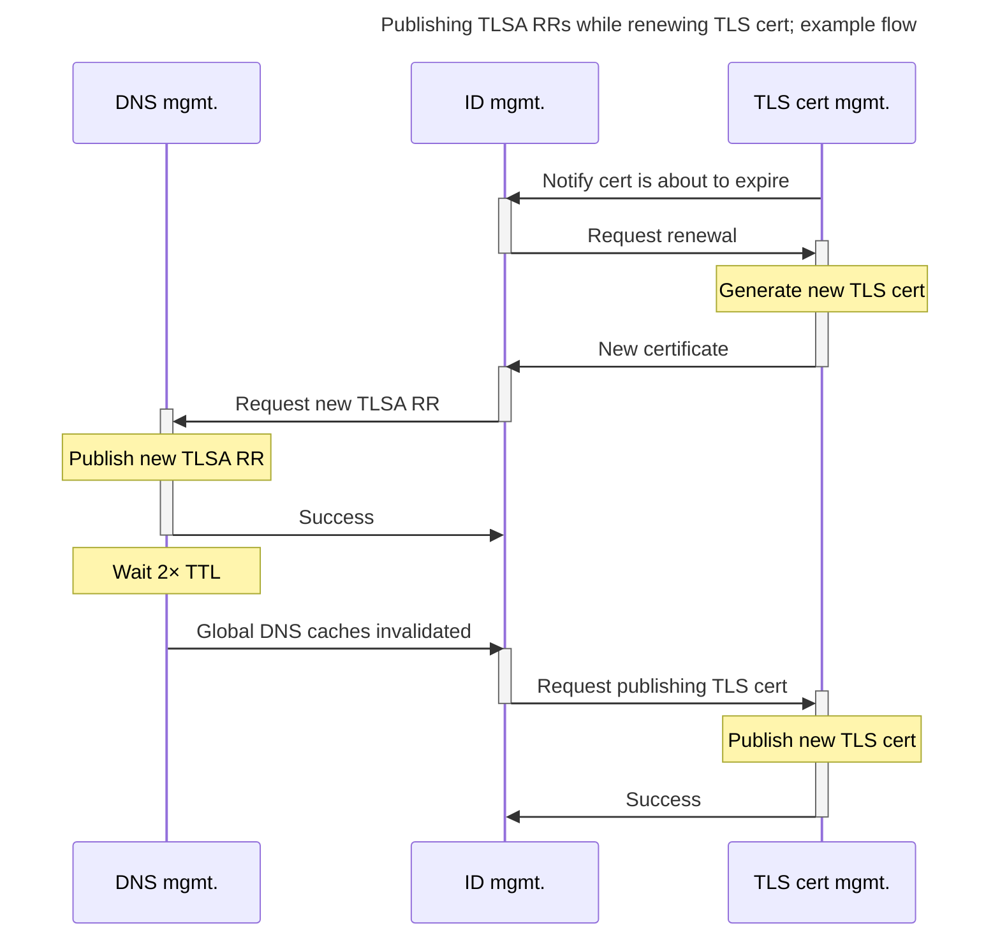
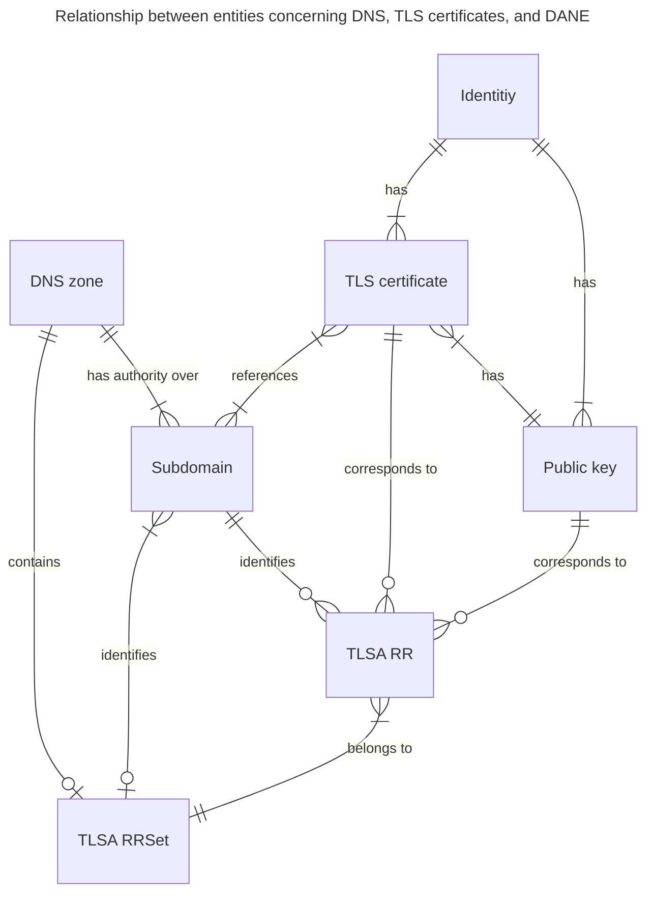

According to RFC 7671, publishing a TLS certificate association (TLSA Resource Record) into the DNS requires coordination with publishing the TLS certificate itself.
Both the TLSA Resource Record and the TLS certificate can be published automatically, however, they cannot be published completely independently.
Therefore, ensuring that DANE can be enabled automatically requires a single system that has access to both DNS zone management as well as TLS certification management for the same domain.
These two management “subsystems” might either be integrated into the same code base or communicate via an API.
Systems that automatically renew TLS certificates already exist.

When publishing a TLS certificate, an application that verifies DANE authentication will check, if TLSA RRs exist for a given domain.
If at least one such record exists, the TLS certificate is validated against the TLSA RRSet.
At any point in time, the _current_ TLS certificate must correspond to at least one TLSA RR for every available TLSA parameter combination, therefore it is important to publish TLSA RRs and verify that they exist in all DNS caches _before_ publishing the TLS certificate; otherwise, DANE authentication will fail.
DANE clients that perform this DNS-based authentication will either refuse the TLS connection, which diminishes availability, or display a warning to the user, which lowers the users’ trust in the site hosted by the domain.

A certificate binds a public key to a signature; the public key is owned by an identity.
Effectively, a system that manages both TLS certificates and the DNS entries of the domain can be considered to be an “identity manager”.
Such an identity manager can manage various identities: a collection of public keys certified by a collection of certificates.
There are different stages (or states) that a certificate transitions through while it and its corresponding TLSA RR are being published.
These stages can be exposed to the user, and the user has different actions available for each state.

## Model

<https://www.cloudflare.com/learning/dns/glossary/dns-zone>

The left half (including “TLSA RR”) is the DNS side, the right half is the web service side.
This diagram models the relationships between the relevant entities of this thesis.
It helps visualize what exactly is affected by the proposed identity manager.
There are five links that can have a cardinality of zero; if and only if all of them are assumed to be exactly zero in a specific system, it means that this system does not support DANE (at least the TLSA variety).

Note:
Based on the ER model, every object might have its own state diagram; these might be completely independent.
Each object has its own “happy” state: as long as it stays there, everything is fine.
If it doesn’t, something probably needs to happen, but not everything requires user interaction.
